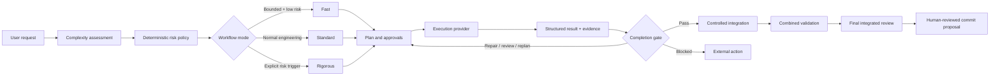

<div align="center">

# LeanRigor

### The right amount of engineering rigor for every AI coding task.

**Adaptive planning, execution control, validation, and review for coding agents.**

[](LICENSE)
[](#quick-start)
[](docs/setup.md)
[](#project-status)
[](CONTRIBUTING.md)

</div>

LeanRigor keeps small, clearly bounded changes lightweight while applying stronger planning, approvals, isolation, validation, and review when the work carries more risk.

It separates **task complexity** from **workflow risk**, then selects a proportional workflow:

| ⚡ Fast | 🛠️ Standard | 🛡️ Rigorous |
|---|---|---|
| Clearly bounded, low-risk changes | Normal features, fixes, and refactors | Security, migrations, public contracts, production systems, concurrency, data integrity, destructive operations, and high blast radius |
| Compact plan and targeted validation | Phased plan, explicit approval, and integrated review | Explicit approach gate, isolated risk boundaries, stronger evidence, and deeper review |
| Must have positive evidence that Fast is safe | Default for normal engineering work | Deterministic risk triggers can require it |

> **Execution providers do the work. LeanRigor decides what may run, what evidence is required, and whether the result is accepted.**

## See it adapt

The same command surface produces different engineering depth:

| Request | LeanRigor response |
|---|---|
| `Fix a typo in README.md` | **Fast** — one compact phase, targeted validation, diff sanity review |
| `Add an optional API field and update its consumer` | **Standard** — contract, consumer, regression coverage, explicit plan approval |
| `Add a database migration affecting authenticated production requests` | **Rigorous** — deterministic escalation, isolated migration boundary, broader validation, deep review |

## Quick start

### Claude Code marketplace

```text
/plugin marketplace add sumanshusamarora/LeanRigor
/plugin install leanrigor@leanrigor
```

Then, from any repository:

```text
/leanrigor:start Add an optional API field and update its consumer
```

LeanRigor creates repository-local state under `.leanrigor/`, presents the selected mode and approvals conversationally, coordinates phased work, requires completion evidence, runs final integrated review, and proposes commits without creating the final user commit or pushing.

📖 **New to LeanRigor?** Follow the [first-workflow guide](docs/first-workflow.md) for a step-by-step walkthrough — from installation to your first commit proposal.

Other useful commands:

```text
/leanrigor:init
/leanrigor:plan
/leanrigor:status
/leanrigor:review
/leanrigor:commit
```

> [!NOTE]
> The npm package is not yet published as a stable public package. The Claude Code marketplace is the recommended user installation path. See [Setup](docs/setup.md) for source and project-local development installation.

## Why LeanRigor exists

[Superpowers](https://github.com/obra/superpowers) shows how much better coding agents can perform with disciplined brainstorming, planning, testing, verification, and review.

In my own use, however, applying a comprehensive workflow to every task could make small changes take roughly **5–20× longer than working with the coding agent directly**. That is a personal observation from my workflows, not a controlled benchmark.

The problem was not engineering discipline. The problem was applying similar depth regardless of the task.

LeanRigor began with a different question:

> **Can we preserve strong engineering practices while applying only the ceremony justified by the task's risk and complexity?**

A documentation typo should not be treated like a production migration. A production migration should never be treated like a documentation typo.

### LeanRigor and Superpowers

Both projects value planning, testing, verification, and review. They make different product choices about **when** those practices apply, **how deeply** they apply, and **who decides that work is complete**.

| Area | Superpowers | LeanRigor |
|---|---|---|
| Primary idea | A comprehensive software-development methodology for coding agents | An adaptive workflow and policy control plane |
| Workflow depth | Strong, consistently guided engineering process | Fast, Standard, or Rigorous based on complexity and explicit risk |
| Small tasks | Still benefit from structured methodology and skills | Stay lightweight only when positive evidence shows they are bounded and low risk |
| High-risk tasks | Strong planning, testing, verification, and review practices | Deterministic escalation, explicit approvals, persisted evidence, isolated workspaces, and integration gates |
| Completion | Verification discipline before completion claims | Provider results are evidence; deterministic completion gates decide whether a phase passes |
| Model selection | May vary by agent role and platform | Portable `small`, `medium`, `large`, and `inherit` capability tiers are part of policy |
| Architecture | Methodology and agent skills | Separates LeanRigor-owned governance from provider-owned worker execution |
| Best fit | Developers wanting a strong end-to-end methodology | Developers and teams wanting engineering depth proportional to risk with resumable control and audit state |

This comparison explains the different design emphasis. It is not a claim that one approach universally replaces the other.

## How it works



LeanRigor owns:

- triage, complexity and risk classification, and final mode selection;
- planning, phase DAGs, approvals, and dispatch eligibility;
- ownership and conflict policy;
- evidence requirements and deterministic completion gates;
- integration ordering, combined validation, final review, resumability, and audit state.

Execution providers own:

- launching workers;
- provider-specific lifecycle, status, heartbeat, timeout, and cancellation;
- returning structured results.

A provider process exiting successfully does **not** complete a phase. LeanRigor collects the result, checks evidence and validation, applies deterministic policy, and only then accepts, repairs, reviews, replans, or blocks the phase.

## Implemented and verified

### Adaptive workflow and governance

- Fast, Standard, and Rigorous workflow modes.
- Complexity and workflow risk assessed separately.
- Model-backed triage with schema validation, one retry, deterministic policy overrides, and deterministic fallback.
- Explicit approach and plan approvals where required.
- Portable model tiers: `small`, `medium`, `large`, and `inherit`.
- Repository policy minimums that personal configuration cannot weaken.

### Evidence, persistence, and integration

- Repository-local, versioned workflow state under `.leanrigor/`.
- Atomic revisions, persistent workflow locks, durable phase leases, heartbeats, and stale-lease recovery.
- Small functional phases with dependencies, acceptance criteria, expected areas, and validation expectations.
- Per-phase evidence-based completion gates with bounded repair, review, replan, and blocked outcomes.
- Isolated phase and integration Git worktrees that leave the user's original working tree untouched.
- Internal mechanical transfer commits on LeanRigor-owned branches only.
- Controlled integration order, textual conflict preservation, combined validation tied to the current integration head, and final integrated review.

### Execution providers

- Provider-neutral `ExecutionCoordinator` and `ExecutionProvider` boundary.
- Deterministic scripted provider and disposable real-Git test harness.
- Persisted dispatch, provider-session provenance, polling, heartbeat, timeout, cancellation, recovery, partial-diff checkpoints, result collection, completion-gate, integration, and final-review progression.
- Bounded Claude CLI execution provider prototype for authenticated headless smoke testing with preserved partial progress on provider failure.

### Claude Code integration

- Native marketplace commands and auto-bootstrap on first use.
- Project-local fallback for development and repositories that need local `.claude/` assets.
- Read-only triage agent.
- Git-protection hook blocking automatic `git commit`, `git push`, and `git reset --hard` in Claude-controlled execution paths.
- Installation and version diagnostics through `/leanrigor:init` and `leanrigor doctor`.

See [Implementation status](IMPLEMENTATION_STATUS.md) for the detailed verification inventory.

## Safety boundaries

LeanRigor deliberately does **not** automatically:

- create the final user commit;
- push to a remote;
- deploy;
- perform destructive production writes;
- resolve integration conflicts by choosing `ours` or `theirs`;
- persist hidden chain of thought.

Internal mechanical commits may be created only on LeanRigor-owned phase and integration branches to support controlled transfer and validation. They are not the final user commit and are never pushed automatically.

## Project status

> [!IMPORTANT]
> **LeanRigor is early-stage and actively evolving.**
>
> Claude Code is the first supported coding-agent integration. The workflow engine, deterministic policy, evidence gates, isolated Git workspaces, and provider boundary are implemented, but several capabilities remain experimental or planned.

Known limitations:

- Claude Code is the only supported coding-agent integration today.
- The Claude CLI execution provider is a prototype and requires an authenticated local Claude CLI for live smoke testing.
- Native Claude subagent orchestration is not yet integrated.
- Scheduling and the coordinator are parallel-capable, but autonomous multi-agent execution is not yet presented as a stable user-facing capability.
- Textual integration conflicts are detected and preserved; semantic conflict repair is not implemented.
- OpenCode, Codex, Cursor, Copilot, and other adapters remain roadmap items.
- The npm package remains private and unpublished; source installation is for development and pre-release testing.

## Configuration

LeanRigor separates team policy from personal provider choices:

| Layer | Location | Intended use |
|---|---|---|
| User preferences | `~/.config/leanrigor/config.json` | Personal defaults and concrete model choices |
| Repository policy | `leanrigor.config.json` | Committed team safety policy, portable routing requirements, and caps |
| Local overrides | `.leanrigor/config.json` | Private repository-specific values and runtime state references |
| Runtime state | `.leanrigor/workflows/` | Persisted workflows, evidence, gates, and resumability |

The central resolver applies built-in and adapter defaults, then user preferences, repository policy, and local configuration before re-applying repository-policy constraints. Personal and local settings cannot weaken committed safety minimums or caps. Claude model aliases may also resolve through the standard `ANTHROPIC_DEFAULT_*` environment variables.

See the [configuration reference](docs/configuration.md).

<details>
<summary><strong>Install from source or create project-local Claude assets</strong></summary>

Node.js 20 or later is required.

```bash
npm install
npm run build
npm pack
npm install -g ./leanrigor-$(node -p "require('./package.json').version").tgz

leanrigor init --adapter claude --root /path/to/repository
leanrigor doctor --adapter claude --root /path/to/repository
```

This path is intended for development and pre-release testing. It creates LeanRigor-owned project-local `.claude/` assets while preserving unrelated user files.

</details>

## Documentation

| Start here | Deep dives |
|---|---|
| [**First workflow**](docs/first-workflow.md) | [Architecture](ARCHITECTURE.md) |
| [Product rationale](PRODUCT.md) | [Workflow and completion gates](docs/workflow.md) |
| [Setup](docs/setup.md) | [Engineering methodology](docs/methodology.md) |
| [Claude Code adapter](docs/claude-code.md) | [Configuration reference](docs/configuration.md) |
| [Claude marketplace plugin](docs/claude-marketplace.md) | [Contributor architecture](docs/contributor-architecture.md) |
| [Current implementation status](IMPLEMENTATION_STATUS.md) | |
| [Support](SUPPORT.md) | [Security](SECURITY.md) |
| [Contributing](CONTRIBUTING.md) | [Governance](GOVERNANCE.md) and [releasing](RELEASING.md) |

## Contributing

This is only the beginning. Pull requests, issue reports, architecture critiques, and improvement ideas are welcome—not only code.

Useful contributions include:

- real-world Fast, Standard, and Rigorous classification examples;
- onboarding, README, examples, and documentation improvements;
- provider and coding-agent adapters;
- Windows and cross-platform testing;
- workflow benchmarks and reproducible performance evidence;
- execution, workspace, and integration safety tests;
- simpler reusable alternatives to custom infrastructure.

Found a weak assumption or unnecessary piece of complexity? Please open an issue. **LeanRigor should improve through evidence, not founder conviction.**

Read [CONTRIBUTING.md](CONTRIBUTING.md) and the [contributor architecture guide](docs/contributor-architecture.md) before changing workflow state, policy, execution, or Git integration.

## Roadmap

Near-term themes include:

- native Claude phase-worker orchestration;
- integrated semantic conflict repair;
- additional coding-agent and execution-provider adapters;
- cross-platform CI and release automation;
- reproducible workflow-quality, latency, and token-use benchmarks.

Roadmap items are not presented as implemented capabilities. Track and discuss them through GitHub issues.

## License

LeanRigor is released under the [MIT License](LICENSE).
