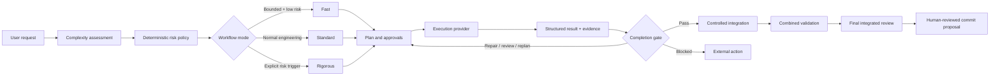

<div align="center">

# LeanRigor

### The right amount of engineering rigor for every AI coding task.

**Adaptive planning, execution control, validation, and review for coding agents.**

[](LICENSE)
[](#quick-start)
[](docs/setup.md)
[](#project-status)
[](CONTRIBUTING.md)

</div>

LeanRigor keeps small, clearly bounded changes lightweight while applying stronger planning, approvals, isolation, validation, and review when the work carries more risk.

It separates **task complexity** from **workflow risk**, then selects a proportional workflow:

| ⚡ Fast | 🛠� Standard | 🛡� Rigorous |
|---|---|---|
| Clearly bounded, low-risk changes | Normal features, fixes, and refactors | Security, migrations, public contracts, production systems, concurrency, data integrity, destructive operations, and high blast radius |
| Compact plan and targeted validation | Phased plan, explicit approval, and integrated review | Explicit approach gate, isolated risk boundaries, stronger evidence, and deeper review |
| Must have positive evidence that Fast is safe | Default for normal engineering work | Deterministic risk triggers can require it |

> **Execution providers do the work. LeanRigor decides what may run, what evidence is required, and whether the result is accepted.**

## See it adapt

The same command surface produces different engineering depth:

| Request | LeanRigor response |
|---|---|
| `Fix a typo in README.md` | **Fast** — one compact phase, targeted validation, diff sanity review |
| `Add an optional API field and update its consumer` | **Standard** — contract, consumer, regression coverage, explicit plan approval |
| `Add a database migration affecting authenticated production requests` | **Rigorous** — deterministic escalation, isolated migration boundary, broader validation, deep review |

## Quick start

### Claude Code marketplace

```text
/plugin marketplace add sumanshusamarora/LeanRigor
/plugin install leanrigor@leanrigor
```

Then, from any repository:

```text
/leanrigor:start Add an optional API field and update its consumer
```

LeanRigor creates repository-local state under `.leanrigor/`, presents the selected mode and approvals conversationally, coordinates phased work, requires completion evidence, runs final integrated review, and proposes commits without creating the final user comit or pushing.

Other useful commands:

```text
/leanrigor:init
/leanrigor:plan
/leanrigor:status
/leanrigor:review
/leanrigor:commit
```

> [!NOTE]
> The npm package is not yet published as a stable public package. The Claude Code marketplace is the recommended user installation path. See [Setup](docs/setup.md) for source and project-local development installation.

## Why LeanRigor exists

[Superpowers](https://github.com/obra/superpowers) shows how much better coding agents can perform with disciplined brainstorming, planning, testing,verification, and review.

In my own use, however, applying a comprehensive workflow to every task could make small changes take roughly **5–20× longer than working with the coding agent directly**. That is a personal observation from my workflows, not a controlled benchmark.

The problem was not engineering discipline. The problem was applying similar depth regardless of the task.

LeanRigor began with a different question:

> **Can we preserve strong engineering practices while applying only the ceremony justified by the task's risk and complexity?**

A documentation typo should not be treated like a production migration. A production migration should never be treated like a documentation typo.

### LeanRigor and Superpowers

Both projects value planning, testing,verification, and review. They make different product choices about **when** those practices apply, **how deeply** they apply, and **who decides that work is complete**.

| Area | Superpowers | LeanRigor |
|---|---|---|
| Primary idea | A comprehensive software-development methodology for coding agents | An adaptive workflow and policy control plane |
| Workflow depth | Strong, consistently guided engineering process | Fast, Standard, or Rigorous based on complexity and explicit risk |
| Small tasks | Still benefit from structured methodology and skills | Stay lightweight only when positive evidence shows they are bounded and low risk |
| High-risk tasks | Strong planning, testing, verification, and review practices | Deterministic escalation, explicit approvals, persisted evidence, isolated workspaces, and integration gates |
| Completion | Verification discipline before completion claims | Provider results are evidence; deterministic completion gates decide whether a phase passes |
| Model selection | May vary by agent role and platform | Portable `small`, `medium`, `large`, and `inherit` capability tiers are part of policy |
| Architecture | Methodology and agent skills | Separates LeanRigor-owned governance from provider-owned worker execution |
| Best fit | Developers wanting a strong end-to-end methodology | Developers and teams wanting engineering depth proportional to risk with resumable control and audit state |

This comparison explains the different design emphasis. It is not a claim that one approach universally replaces the other.

## How it works



LeanRigor owns:

- triage, complexity and risk classification, and final mode selection;
- planning, phase DAGs, approvals, and dispatch eligibility;
- ownership and conflict policy;
- evidence requirements and deterministic completion gates;
- integration ordering, combined validation, final review, resumability, and audit state.

Execution providers own:

- launching workers;
- provider-specific lifecycle, status, heartbeat, timeout, and cancellation;
- returning structured results.

A provider process exiting successfully does **not** complete a phase. LeanRigor collects the result, checks evidence and validation, applies deterministic policy, and only then accepts, repairs, reviews, replans, or blocks the phase.

## Implemented and verified

### Adaptive workflow and governance

- Fast, Standard, and Rigorous workflow modes.
- Complexity and workflow risk assessed separately.
- Model-backed triage with schema validation, one retry, deterministic policy overrides, and deterministic fallback.
- Explicit approach and plan approvals where required.
- Portable model tiers: `small`, `medium`, `large`, and `inherit`.
- Repository policy minimums that personal configuration cannot weaken.

### Evidence, persistence, and integration

- Repository-local, versioned workflow state under `.leanrigor/`.
- Atomic revisions, persistent workflow locks, durable phase leases, heartbeats, and stale-lease recovery.
- Small functional phases with dependencies, acceptance criteria, expected areas, and validation expectations.
- Per-phase evidence-based completion gates with bounded repair, review, replan, and blocked outcomes.
- Isolated phase and integration Git worktrees that leave the user's original working tree untouched.
- Internal mechanical transfer commits on LeanRigor-owned branches only.
- Controlled integration order, textual conflict preservation, combined validation tied to the current integration head, and final integrated review.

### Execution providers

- Provider-neutral `ExecutionCoordinator` and `ExecutionProvider` boundary.
- Deterministic scripted provider and disposable real-Git test harness.
- Persisted dispatch, polling, heartbeat, timeout, cancellation, recovery, result collection, completion-gate, integration, and final-review progression.
- Claude CLI execution provider prototype for authenticated headless smoke testing.

### Claude Code integration

- Native marketplace commands and auto-bootstrap on first use.
- Project-local fallback for development and repositories that need local `.claude/` assets.
- Read-only triage agent.
- Git-protection hook blocking automatic `git commit`, `git push`, and `git reset --hard` Šr6ÆVFRÖ6öçG&öÆÆVBW†V7WF–öâF‡2à¢Ò–ç7FÆÆF–öâæBfW'6–öâF–væ÷7F–72F‡&÷Vv‚öÆVç&–v÷#¦–æ—FæBÆVç&–v÷"Fö7F÷&à ¥6VR´–×ÆVÖVçFF–öâ7FGW5Ò„”ÕÄTÔTåDD”ôåõ5DEU2æÖB’f÷"F†RFWF–ÆVBfW&–f–6F–öâ–çfVçF÷'’à ¢226fWG’&÷VæF&–W0 ¤ÆVå&–v÷"FVÆ–&W&FVÇ’FöW2¢¦æ÷B¢¢WFöÖF–6ÆÇ“  ¢Ò7&VFRF†Rf–æÂW6W"6öÖÖ—C°¢ÒW6‚Fò&VÖ÷FS°¢ÒFWÆ÷“°¢ÒW&f÷&ÒFW7G'V7F—fR&öGV7F–öâw&—FW3°¢Ò&W6öÇfR–çFVw&F–öâ6öæfÆ–7G2'’6†ö÷6–ær÷W'6÷"F†V—'6°¢ÒW'6—7B†–FFVâ6†–âöbF†÷Vv‡Bà ¤–çFW&æÂÖV6†æ–6Â6öÖÖ—G2Ö’&R7&VFVBöæÇ’öâÆVå&–v÷"Ö÷væVB†6RæB–çFVw&F–öâ'&æ6†W2Fò7W÷'B6öçG&öÆÆVBG&ç6fW"æBfÆ–FF–öââF†W’&Ræ÷BF†Rf–æÂW6W"6öÖÖ—BæB&RæWfW"W6†VBWFöÖF–6ÆÇ’à ¢22&ö¦V7B7FGW0 £â²”Õõ%DåEУ⢤ÆVå&–v÷"—2V&Ç’×7FvRæB7F—fVÇ’WföÇf–ær⢠£à£â6ÆVFR6öFR—2F†Rf—'7B7W÷'FVB6öF–ærÖvVçB–çFVw&F–öââF†Rv÷&¶fÆ÷rVæv–æRÂFWFW&Ö–æ—7F–2öÆ–7’ÂWf–FVæ6RvFW2—6öÆFVBv—Bv÷&·76W2ÂæB&÷f–FW"&÷VæF'’&R–×ÆVÖVçFVBÂ'WB6WfW&Â6&–Æ—F–W2&VÖ–âW‡W&–ÖVçFÂ÷"ÆææVBà ¤¶æ÷vâÆ–Ö—FF–öç3  ¢Ò6ÆVFR6öFR—2F†RöæÇ’7W÷'FVB6öF–ærÖvVçB–çFVw&F–öâFöF’à¢ÒF†R6ÆVFR4Ä’W†V7WF–öâ&÷f–FW"—2&÷F÷G—RæB&WV—&W2âWF†VçF–6FVBÆö6Â6ÆVFR4Ä’f÷"Æ—fR6Öö¶RFW7F–ærà¢ÒæF—fR6ÆVFR7V&vVçB÷&6†W7G&F–öâ—2æ÷B–WB–çFVw&FVBà¢Ò66†VGVÆ–æræBF†R6ö÷&F–æF÷"&R&ÆÆVÂÖ6&ÆRÂ'WBWFöæöÖ÷W2×VÇF’ÖvVçBW†V7WF–öâ—2æ÷B–WB&W6VçFVB27F&ÆRW6W"Öf6–ær6&–Æ—G’à¢ÒFW‡GV–çFVw&F–öâ6öæfÆ–7G2&RFWFV7FVBæB&W6W'fVC²6VÖçF–26öæfÆ–7B&W—"—2æ÷B–×ÆVÖVçFVBà¢Ò÷Vä6öFRÂ6öFW‚Â7W'6÷"Â6÷–Æ÷BÂæB÷F†W"FFW'2&VÖ–â&öFÖ—FV×2à¢ÒF†RçÒ6¶vR&VÖ–ç2&—fFRæBVçV&Æ—6†VC²6÷W&6R–ç7FÆÆF–öâ—2f÷"FWfVÆ÷ÖVçBæB&R×&VÆV6RFW7F–ærà ¢226öæf–wW&F–öà ¤ÆVå&–v÷"6W&FW2FVÒöÆ–7’g&öÒW'6öæÂ&÷f–FW"6†ö–6W3  §ÂÆ–W"ÂÆö6F–öâ–çFVæFVBW6RÀ§ÂÒÒ×ÂÒÒ×ÂÒÒ×À§ÂW6W"&VfW&Væ6W2Ââòæ6öæf–röÆVç&–v÷"ö6öæf–ræ§6öæÂW'6öæÂFVfVÇG2æB6öæ7&WFRÖöFVÂ6†ö–6W2À§Â&W÷6—F÷'’öÆ–7’ÂÆVç&–v÷"æ6öæf–ræ§6öæÂ6öÖÖ—GFVBFVÒ6fWG’öÆ–7’Â÷'F&ÆR&÷WF–ær&WV—&VÖVçG2ÂæB62À§ÂÆö6Â÷fW'&–FW2ÂæÆVç&–v÷"ö6öæf–ræ§6öæÂ&—fFR&W÷6—F÷'’×7V6–f–2fÇVW2æB'VçF–ÖR7FFR&VfW&Væ6W2À§Â'VçF–ÖR7FFRÂæÆVç&–v÷"÷v÷&¶fÆ÷w2öÂW'6—7FVBv÷&¶fÆ÷w2ÂWf–FVæ6RÂvFW2ÂæB&W7VÖ&–Æ—G’À ¥F†R6VçG&Â&W6öÇfW"Æ–W2'V–ÇBÖ–âæBFFW"FVfVÇG2ÂF†VâW6W"&VfW&Væ6W2Â&W÷6—F÷'’öÆ–7’ÂæBÆö6Â6öæf–wW&F–öâ&Vf÷&R&RÖÇ––ær&W÷6—F÷'’×öÆ–7’6öç7G&–çG2âW'6öæÂæBÆö6Â6WGF–æw26ææ÷BvV¶Vâ6öÖÖ—GFVB6fWG’Ö–æ–×V×2÷"62â6ÆVFRÖöFVÂÆ–6W2Ö’Ç6ò&W6öÇfRF‡&÷Vv‚F†R7FæF&BåD…$õ”5ôDTdTÅEò¦Vçf—&öæÖVçBf&–&ÆW2à ¥6VRF†R¶6öæf–wW&F–öâ&VfW&Væ6UÒ†Fö72ö6öæf–wW&F–öâæÖB’à £ÆFWF–Ç3à£Ç7VÖÖ'“ãÇ7G&öæsä–ç7FÆÂg&öÒ6÷W&6R÷"7&VFR&ö¦V7BÖÆö6Â6ÆVFR76WG3Â÷7G&öæsãÂ÷7VÖÖ'“à ¤æöFRæ§2#÷"ÆFW"—2&WV—&VBà ¦&6€¦çÒ–ç7FÆÀ¦çÒ'Vâ'V–Æ@¦çÒ6°¦çÒ–ç7FÆÂÖrâöÆVç&–v÷"ÒB†æöFR×'&WV—&R‚râ÷6¶vRæ§6öâr’çfW'6–öâ"’çFw  ¦ÆVç&–v÷"–æ—BÒÖFFW"6ÆVFRÒ×&ö÷B÷F‚÷Fò÷&W÷6—F÷'�¦ÆVç&–v÷"Fö7F÷"ÒÖFFW"6ÆVFRÒ×&ö÷B÷F‚÷Fò÷&W÷6—F÷'�¦ ¥F†—2F‚—2–çFVæFVBf÷"FWfVÆ÷ÖVçBæB&R×&VÆV6RFW7F–ærâ—B7&VFW2ÆVå&–v÷"Ö÷væVB&ö¦V7BÖÆö6Âæ6ÆVFRö76WG2v†–ÆR&W6W'f–ærVç&VÆFVBW6W"f–ÆW2à £ÂöFWF–Ç3à ¢22Fö7VÖVçFF–öà §Â7F'B†W&RÂFVWF—fW2À§ÂÒÒ×ÂÒÒ×À§Âµ&öGV7B&F–öæÆUÒ…$ôET5BæÖB’´&6†—FV7GW&UÒ„$4„•DT5EU$RæÖB’À§Âµ6WGWÒ†Fö72÷6WGWæÖB’µv÷&¶fÆ÷ræB6ö×ÆWF–öâvFW5Ò†Fö72÷v÷&¶fÆ÷ræÖB’À§Â´6ÆVFR6öFRFFW%Ò†Fö72ö6ÆVFRÖ6öFRæÖB’´Væv–æVW&–ærÖWF†öFöÆöw•Ò†Fö72öÖWF†öFöÆöw’æÖB’À§Â´6ÆVFRÖ&¶WGÆ6RÇVv–åÒ†Fö72ö6ÆVFRÖÖ&¶WGÆ6RæÖB’´6öæf–wW&F–öâ&VfW&Væ6UÒ†Fö72ö6öæf–wW&F–öâæÖB’À§Â´7W'&VçB–×ÆVÖVçFF–öâ7FGW5Ò„”ÕÄTÔTåDD”ôåõ5DEU2æÖB’´6öçG&–'WF÷"&6†—FV7GW&UÒ†Fö72ö6öçG&–'WF÷"Ö&6†—FV7GW&RæÖB’À§Âµ7W÷'EÒ…5Uõ%BæÖB’µ6V7W&—G•Ò…4T5U$•E’æÖB’À§Â´6öçG&–'WF–æuÒ„4ôåE$”%UD”äræÖB’´v÷fW&ææ6UÒ„tõdU$ää4RæÖB’æB·&VÆV6–æuÒ…$TÄT4”äræÖB’À ¢226öçG&–'WF–æp ¥F†—2—2öæÇ’F†R&Vv–ææ–ærâVÆÂ&WVW7G2—77VR&W÷'G2Â&6†—FV7GW&R7&—F—VW2ÂæB–×&÷fVÖVçB–FV2&RvVÆ6öÖ^(	Fæ÷BöæÇ’6öFRà ¥W6VgVÂ6öçG&–'WF–öç2–æ6ÇVFS  ¢Ò&VÂ×v÷&ÆBf7BÂ7FæF&BÂæB&–v÷&÷W26Æ76–f–6F–öâW†×ÆW3°¢Òöæ&ö&F–ærÂ$TDÔRÂW†×ÆW2ÂæBFö7VÖVçFF–öâ–×&÷fVÖVçG3°¢Ò&÷f–FW"æB6öF–ærÖvVçBFFW'3°¢Òv–æF÷w2æB7&÷72×ÆFf÷&ÒFW7F–æs°¢Òv÷&¶fÆ÷r&Væ6†Ö&·2æB&W&öGV6–&ÆRW&f÷&Öæ6RWf–FVæ6S°¢ÒW†V7WF–öâÂv÷&·76RÂæB–çFVw&F–öâ6fWG’FW7G3°¢Ò6–×ÆW"&WW6&ÆRÇFW&æF—fW2Fò7W7FöÒ–æg&7G'V7GW&Rà ¤f÷VæBvV²77V×F–öâ÷"VææV6W76'’–V6Röb6ö×ÆW†—G“òÆV6R÷Vââ—77VR⢤ÆVå&–v÷"6†÷VÆB–×&÷fRF‡&÷Vv‚Wf–FVæ6RÂæ÷Bf÷VæFW"6öçf–7F–öâ⢠ ¥&VB´4ôåE$”%UD”äræÖEÒ„4ôåE$”%UD”äræÖB’æBF†R¶6öçG&–'WF÷"&6†—FV7GW&RwV–FUÒ†Fö72ö6öçG&–'WF÷"Ö&6†—FV7GW&RæÖB’&Vf÷&R6†æv–ærv÷&¶fÆ÷r7FFRÂöÆ–7’ÂW†V7WF–öâÂ÷"v—B–çFVw&F–öâà ¢22&öFÖ ¤æV"×FW&ÒF†VÖW2–æ6ÇVFS  ¢ÒæF—fR6ÆVFR†6R×v÷&¶W"÷&6†W7G&F–öã°¢Ò–çFVw&FVB6VÖçF–26öæfÆ–7B&W—#°¢ÒFF—F–öæÂ6öF–ærÖvVçBæBW†V7WF–öâ×&÷f–FW"FFW'3°¢Ò7&÷72×ÆFf÷&Ò4’æB&VÆV6RWFöÖF–öã°¢Ò&W&öGV6–&ÆRv÷&¶fÆ÷r×VÆ—G’ÂÆFVæ7’ÂæBFö¶Vâ×W6R&Væ6†Ö&·2à ¥&öFÖ—FV×2&Ræ÷B&W6VçFVB2–×ÆVÖVçFVB6&–Æ—F–W2âG&6²æBF—67W72F†VÒF‡&÷Vv‚v—D‡V"—77VW2à ¢22Æ–6Vç6P ¤ÆVå&–v÷"—2&VÆV6VBVæFW"F†R´Ô•BÆ–6Vç6UÒ„Ä”4Tå4R’à