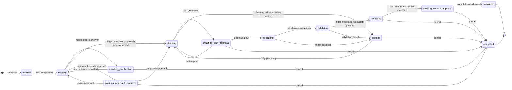
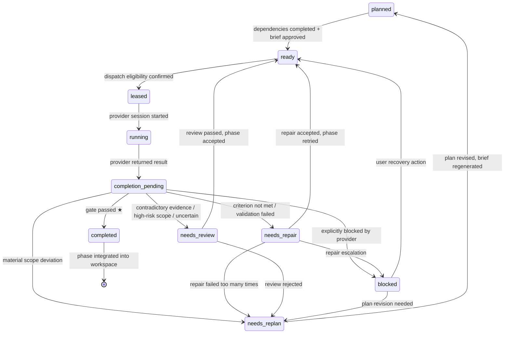
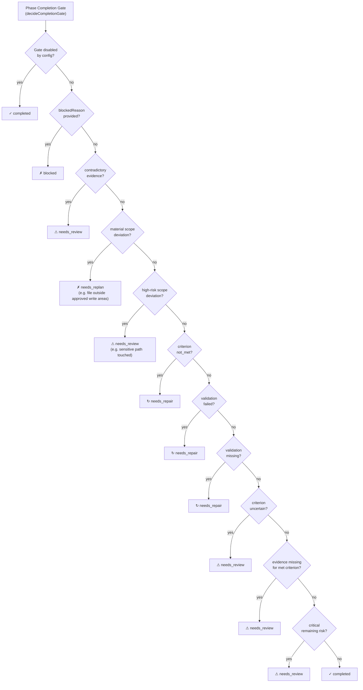
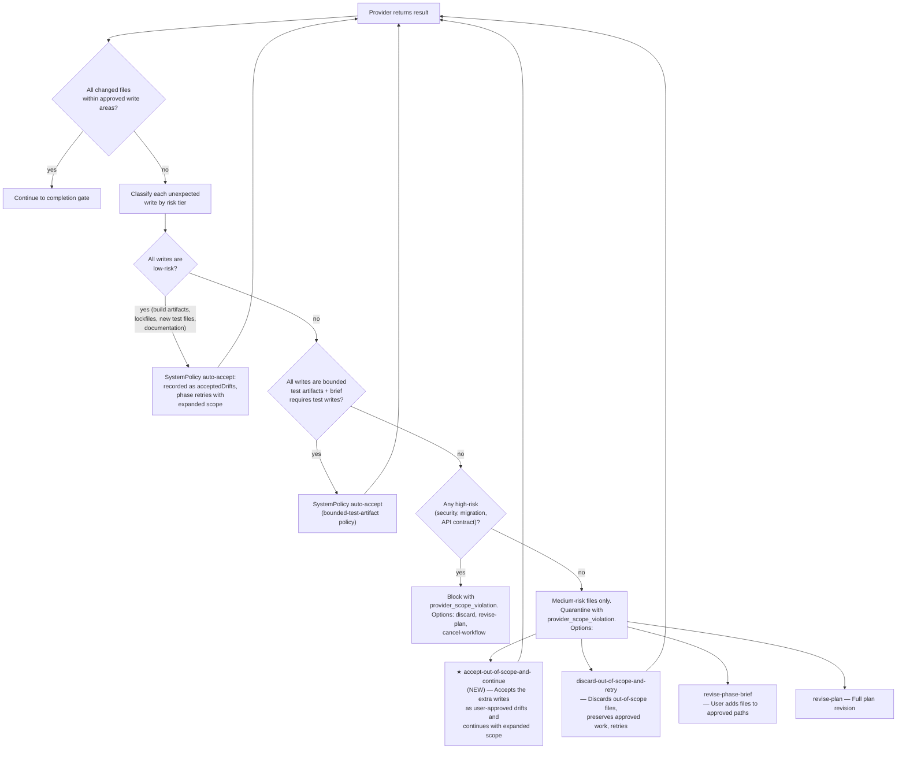
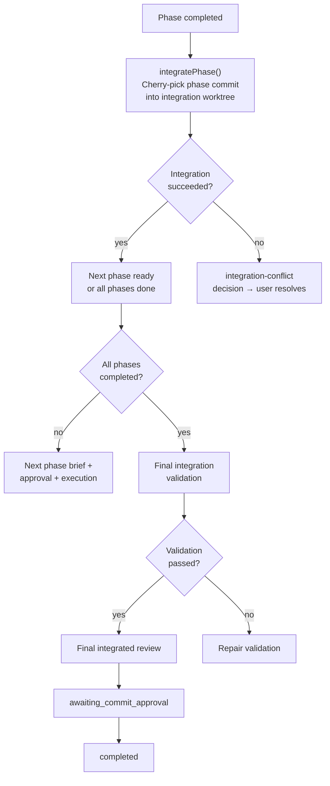

# LeanRigor Workflow Lifecycle — End-to-End Flow

This document maps every state, transition, gate, and recovery path in the
LeanRigor workflow engine. It's kept in sync with `src/core/flow.ts` and
`src/core/execution/coordinator.ts`.

## Workflow Lifecycle State Machine



## Phase Lifecycle (within `executing`)



## Completion Gate Decision Tree



## Provider Scope Violation — Recovery Paths

When the AI provider writes to a file outside the approved `writeAreas` in the
phase brief, the system classifies the unexpected write by risk tier and
applies proportional handling:



### Risk Classification

| Risk Tier | Examples | Handling |
|-----------|----------|----------|
| **Low** | Build artifacts (`dist/`, `runtime/`), lockfiles, new test files, docs, generated `.d.ts`/`.map` files | **Auto-accepted** by system policy — recorded as `acceptedDrifts` |
| **Medium** | Config files (`.json`, `.yaml`), non-test source files | **User can accept** with one click (`accept-out-of-scope-and-continue`) or discard |
| **High** | Migrations, API schemas, auth/security paths, production config | **Blocked** — requires plan revision |

### Recovery Actions

| Action | Effect | When Available |
|--------|--------|----------------|
| `accept-out-of-scope-and-continue` ★ NEW | Records extra writes as user-approved drifts, continues | Medium-risk files only |
| `discard-out-of-scope-and-retry` | Reverts extra files, preserves approved work, retries | Any unexpected writes |
| `revise-phase-brief` | User provides feedback, brief is regenerated | Always |
| `revise-plan` | Full replan | Always |
| `cancel-workflow` | Give up | Always |

### Automatic Low-Risk Acceptance

Files in these categories are **automatically accepted** without any user
intervention, matching the principle that build artifacts and side-effect
files that change as a natural consequence of implementation should not
block forward progress:

- **Build output directories**: `dist/**`, `build/**`, `runtime/**`, `.next/**`, `coverage/**`, `__pycache__/**`, `target/**`
- **Lockfiles**: `package-lock.json`, `yarn.lock`, `pnpm-lock.yaml`, `Cargo.lock`, etc.
- **New test files** in `tests/` or `__tests__/` directories (untracked additions)
- **Documentation**: `docs/**`, `.md`, `.mdx`, `.rst` files
- **Generated code**: `.d.ts`, `.map`, `.min.js`, `.min.css` files

These are recorded as `acceptedDrifts` with `acceptedBy: "system-policy"` and
do not trigger the execution-recovery decision.

## Integration & Validation Flow



## Key Data Structures

### Phase Execution Brief (`PhaseExecutionBrief`)

The contract between the plan and the provider. Defines:

| Field | Purpose |
|-------|---------|
| `writeAreas` | **The approved file patterns the provider may modify** |
| `readAreas` | File patterns the provider may read |
| `testObligations` | Tests the provider is expected to write |
| `acceptanceCriteria` | Success conditions for the phase |
| `validationCommands` | Commands to verify the phase |
| `exclusions` | Explicitly excluded files/areas |
| `assumptions` | What the brief assumes |
| `materialChangesFromWorkflowPlan` | Drifts from the original plan |

### Scope Deviation Detection (`detectScopeDeviations`)

Flags these categories of out-of-scope changes:

```typescript
// All of these produce "needs_replan":
"changed file outside expected scope: <file>"
"production dependency or package manifest changed outside approved phase scope: <file>"
"migration introduced outside approved phase scope: <file>"
"public contract changed outside approved phase scope: <file>"
"scope deviation: '<file>' classified as <type>. Phase expected documentation changes only."

// This produces "needs_review":
"sensitive path touched by non-rigorous phase: <file>"
```

### Accepted Drifts (`PhaseDriftAcceptance`)

When drift is explicitly accepted (by user or system policy):

```typescript
interface PhaseDriftAcceptance {
  decisionId: string;
  acceptedAt: string;
  acceptedBy: "user" | "system-policy";  // system-policy = automatic
  briefRevision: number;
  reason: string;
  materialChanges: MaterialPlanChange[];
}
```

System-policy drifts expand `approvedWriteAreas()` without user intervention.
Currently only used for bounded test artifacts.

## Configuration Gates That Affect Blocking

From `leanrigor.config.json` / defaults:

| Key | Default | Effect |
|-----|---------|--------|
| `completionGate.enabled` | `true` | When `false`, skips the gate for fully-met criteria |
| `completionGate.requireEvidence` | `true` | When `false`, doesn't block on missing evidence |
| `completionGate.requireValidation` | `true` | When `false`, doesn't block on missing validation |
| `completionGate.allowSkippedValidation.fast` | `true` | Fast mode tolerates skipped validation |
| `completionGate.allowSkippedValidation.standard` | `false` | Standard mode does not |
| `completionGate.maxRepairAttempts.fast` | `1` | Max repair attempts before escalation |
| `completionGate.maxRepairAttempts.standard` | `2` | |
| `execution.sensitivePaths` | `[]` | Extra paths that trigger review on touch |

## Summary of Recommendations

1. **Add an "accept-and-continue" recovery path** for scope violations on non-critical
   files (build artifacts, generated files, lockfiles). Classify files by risk tier
   and auto-accept low-risk ones.

2. **Expand automatic drift acceptance** beyond just test artifacts. Build artifacts
   (`dist/`, `runtime/`, etc.) and dependency manifests that change as a natural
   consequence of the implementation should not require manual intervention.

3. **Simplify the revise-phase-brief UX**. Instead of requiring the user to craft
   freeform feedback, present a structured choice: "Add these files to approved
   write areas?" with explicit file list and accept/reject per file.

4. **Make the completion gate configurable per-file-pattern**. Let repos declare
   patterns that are always auto-accepted (e.g., `runtime/**`, `dist/**`).
